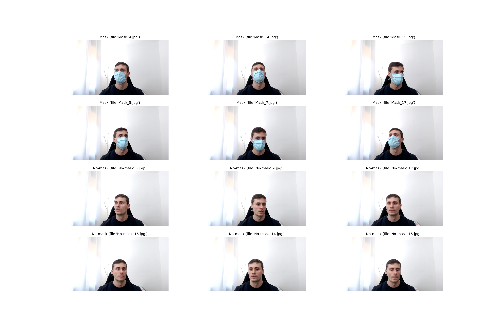

# Real Time Object Detection

## About this notebook

This [notebook](https://github.com/guillermo-lahuerta/Real_time_object_detection/blob/main/Mask_detection.ipynb) contains all the steps to train a Deep Learning model for **Real Time Object Detection**. In this particular project, the object to be detected is a **mask**.

The model presented in this repository has been totally implemented using *open source* tools (such as Python 3 and TensorFlow 2), and is designed to be run on an a system with a NVIDIA graphics card and CUDA architectures (so we can take advantage of **tensorflow-gpu** to speed up the training). If you don't have such an environment, I suggest using Google Colab instead.


The steps described in this project, follow the structure described in this popular TensorFlow [tutorial](https://tensorflow-object-detection-api-tutorial.readthedocs.io/en/latest/training.html). I adapted the proposed structure to be able to detect a **mask** (instead of more common state-of-the-art objects, such as cats, dogs or people).

Actually, I had the idea to create this repository after watching [one](https://www.youtube.com/watch?v=yqkISICHH-U) of Nicholas Renotte's Youtube videos, where he teaches how to build a model to detect *signs*. I strongly suggest to check his videos (he is a Data Scientist at IBM).

I also used an amazing graphical image annotation package, *LabelImg*, to perform the labelling of the pictures myself. This package is developed by [Tzuta Lin](https://github.com/tzutalin/labelImg).

Regarding the technical implementation of the model, I used *transfer learning* to take advantage of a pre-trained Convolutional Neural Network. For the purposes of this model, I obtained great results with the [MobileNet V2](https://arxiv.org/abs/1704.04861) architecture.


## MobileNet v2

Convolutional Neural Networks is the standard architecture for solving tasks associated with images. Some of the well-known deep learning architectures for CNN are LeNet-5 (7 layers), GoogLeNet (22 layers), AlexNet (8 layers), VGG (16–19 layers), or ResNet (152 layers).

In this [repository](https://github.com/tensorflow/models/blob/master/research/object_detection/g3doc/tf2_detection_zoo.md), you can find a huge amount of pre-trained models with different architectures. For this specific project, I just tested the following two models:

- The *SSD ResNet50 V1 FPN 640x640*.
- The *SSD MobilNet V2 FPN 640x640*.


## Data

The dataset used in this model, has been manually taken and labeled. To speed the processes, the repository includes a Python script that automatically takes pictures from your webcam every 2 seconds.




## Data labelling

To annotate the images (i.e., to assign the bounding box and the corresponding *Mask* vs *No-mask* class), I used the [LabelImg](https://github.com/tzutalin/labelImg) library.


## Hyper-parameter tuning

*Hyper-parameter tuning* is used to define the best configuration of the model that results in a better prediction (i.e., a model that *generalises* better). However, for this project, the hyper-parameter tuning consisted on selecting the configuration that allows the model to run on my computer without crashing.

For instance, the batch size has been set to 8, just because 16 was impossible to fit in memory. For the same reason, 5000 epochs were selected (more resulted in a crash of the system).


## Evaluation of the models

In order to monitor the training of the model and also the evaluation, I suggest to take advantage of **TensorBoard** (i.e., TensorFlow's visualization toolkit).

- While training, this tool allows us to see the evolution of the **loss function** epoch after epoch (something extremely useful for Deep Learning models that need hours to be trained).

- After training, TensorBoard allow us to evaluate the **metrics**, and also to check the prediction for the test set.


## Requirements to run the model

* Python 3
* Tensorflow 2


## How to run the Notebook

Clone this repository and navigate to the main folder. To do so, open your Terminal (for MacOS/Linux) or your Command Prompt (for Windows) and run the following commands:
```
git clone https://github.com/guillermo-lahuerta/Real_time_object_detection.git
cd ./Real_time_object_detection/
```

I strongly suggest to create a virtual environment with Conda to manage dependencies and isolate projects. After installing [Miniconda](https://docs.conda.io/en/latest/miniconda.html), run the following commands to update the base conda packages:
```
conda update conda
conda update python
conda update --all
```

Then, create the new conda environment called *object_detection* to store all the dependencies related to this repo:
```
conda create --name object_detection python=3.8.5
conda activate object_detection
```

Now, create a Jupyter Notebook kernel for the new environment:
```
conda install ipykernel jupyter
conda install -c conda-forge jupyter_nbextensions_configurator
conda install -c conda-forge jupyter_contrib_nbextensions
python -m ipykernel install --user --name object_detection --display-name "object_detection"
```

Now, install all required packages:
```
pip install -r requirements.txt
```

### Install TensorFlow
It's time to install *TensorFlow*:

* If you have a NVIDIA graphics card with CUDA architectures, you should consider installing *tensorflow-gpu* (instead of the regular *tensorflow*), to speed up your deep learning models. Rather than using *pip* or *conda* to try to figure out which version of TensorFlow you need, I recommend finding the exact "*.whl*" file from [TensorFlow](https://www.tensorflow.org/install/pip#package-location)’s site. Once you have the *url* of the corresponding TensorFlow version that you need, run the following command (substitute *<whl_url>* with the exact url):
```
pip install <whl_url>
```

* If you don't have a NVIDIA graphics card, you should use *Google Colab* or any other environment that allows GPU computing.


### Run the notebook
To run the app jupyter notebook, use these commands:
```
conda activate object_detection
jupyter notebook
```

If you try to open the notebook in a Windows environment and the Kernel fails, try running the following comand before opening the Notebook:
```
conda install pywin32
```

## Resources

* [TensorFlow](https://www.tensorflow.org/)
* [LabelImg](https://github.com/tzutalin/labelImg)
* [Tensorflow tutorial](https://tensorflow-object-detection-api-tutorial.readthedocs.io/en/latest/training.html)
